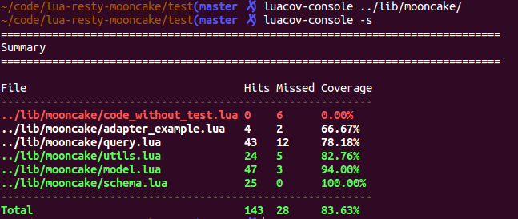

# luacov-console



Luacov-console is a luacov reporter makes it easier for your development cycle and CI.

## Usage

1. Run tests with [luacov](https://github.com/keplerproject/luacov) enabled.
2. Run `luacov-console [workdir]` to generate `luacov.report.out` and `luacov.report.out.index`.
    Unlike luacov, luacov-console also counts lua files under `workdir` which weren't touched by tests.
3. Run `luacov-console -s` to see the summary of coverage results.
4. Run `luacov-console -l [lua pattern1] [lua pattern2]` to see the report of matched files.

## Installation

`[sudo] luarocks install luacov-console`

## Commandline options

```
$ luacov-console -h
Usage: luacov-console [--no-colored] [-s] [-h] [<workdir>]
       [-l <list> [<list>] ...]

Combine luacov with your development cycle and CI

Arguments:
   workdir               Specific the source directory (default: .)

Options:
   --no-colored          Don't print with color.
   -l <list> [<list>] ..., --list <list> [<list>] ...
                         List coverage results of files matched given lua pattern(s).
   -s, --summary         Show coverage summary.
   -h, --help            Show this help message and exit.
```

## TODO

- [ ] Make index file optional.
- [ ] Customize color schema.
